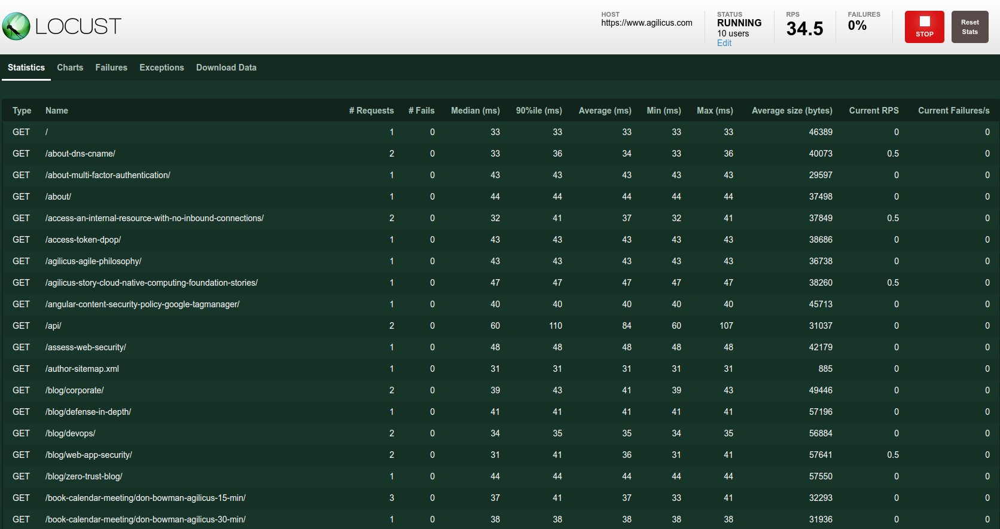
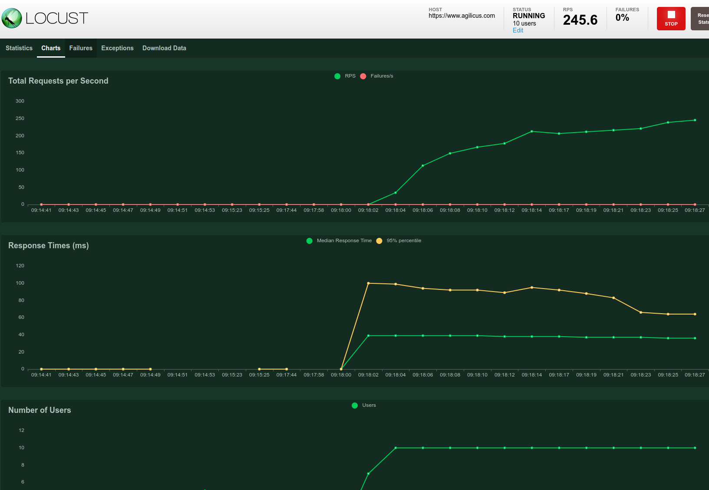

# web-site-load

See the associated [post](https://www.agilicus.com/latency-and-load-testing-web-site)
for more information.

This will parse your robots.txt for Sitemap entries.
It will then load those sitemaps, find all your pages.
From here it will fetch them in random order.

Start with 10 users, spawn time of 5.


```
export SITE=https://mysite.ca
poetry install
poetry run web-site-load
```

Now open your browser to [http://localhost:8089/](http://localhost:8089/)





